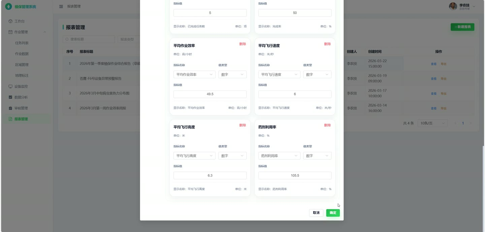
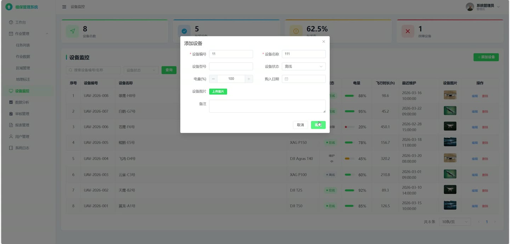

# (附文档)Python+Django+Vue3 无人机植保管理系统

**技术栈**：Python、Django、Vue3、MySQL

### 系统简介

本系统是一套面向无人机植保作业场景的前后端分离管理平台，后端基于 Django REST Framework 提供接口服务，前端使用 Vue3 构建单页应用，数据存储采用 MySQL。系统设置管理员、农技专家、总经理、操作员四类角色，覆盖作业任务、作业数据、设备监控、数据分析、报表与审核等业务环节。
 
### 核心功能
 
### 管理员端

 
- 用户管理：创建用户并设置角色、昵称、手机号，编辑用户资料，删除非管理员账号。 
- 密码重置：对指定用户一键重置登录密码，默认重置为初始密码。 
- 作业任务管理：创建任务时自动生成任务编号，维护任务名称、任务类型、作业区域、作业面积、作物类型与药剂信息。 
- 任务分配：为任务指定执行人员与使用设备，任务状态自动流转为已分配。 
- 区域管理：新增、编辑、删除作业区域，维护区域名称、省市区、面积、作物类型与经纬度坐标。 
- 设备管理：新增、编辑、删除无人机设备，维护设备编号、名称、型号、状态、电量、累计飞行时长与维护时间。 
- 数据分析管理：创建作业效率、作物健康、设备状态三类分析结果，编辑与删除分析记录。 
- 报表管理：创建作业效率、病虫害热力图、设备异常预警、综合报告四类报表，编辑与删除草稿状态报表。 
- 报表审核：对报表与作业数据执行审核通过或退回操作，退回时需填写退回原因。 
- 系统日志：查看操作日志列表，支持按模块、操作类型、结果筛选，并支持一键清空全部日志。
 
### 农技专家端

 
- 作业数据查看：查看操作员上报的作业数据列表与明细。 
- 区域管理：查看作业区域列表与区域下拉选项。 
- 地理标注：按关键词检索区域与设备的地理标注点，查看坐标范围汇总。 
- 设备监控：查看设备列表、设备状态与设备统计数据。 
- 数据分析：创建并维护作业效率、作物健康、设备状态分析结果。 
- 报表管理：创建报表、编辑草稿报表、提交报表审核，并调用默认模板生成报表内容。 
- 报表导出：将报表导出为 Excel 文件，包含标题、类型、内容与 JSON 数据明细。 
- 审核管理：查看本人提交的报表审核记录与审核统计。
 
### 总经理端

 
- 工作台：查看任务统计、设备统计、作业效率汇总与近六个月任务完成趋势。 
- 任务查看：查看全部作业任务列表与任务统计信息。 
- 作业数据查看：查看全部作业数据记录。 
- 区域与地理标注：查看区域列表、区域选项与地理标注数据。 
- 设备监控：查看设备列表与设备统计、平均电量、在线率。 
- 数据分析：查看分析结果列表与默认指标数据。 
- 报表管理：查看报表列表与报表详情。 
- 审核管理：对作业数据与报表执行审核通过或退回操作，查看审核统计与通过率。
 
### 操作员端

 
- 我的任务：仅查看分配给本人的作业任务列表。 
- 开始任务：对已分配任务执行开始操作，系统记录实际开始时间。 
- 提交作业数据：上报飞行高度、飞行速度、喷洒量、覆盖面积、作业时长、药剂消耗量、温度、湿度与风速。 
- 模拟采集：按任务类型生成模拟作业数据与飞行轨迹点，可选择自动提交。 
- 作业数据查看：查看本人提交的作业数据记录。 
- 审核进度：查看本人提交的作业数据审核记录与状态。 
- 个人中心：查看个人信息、更新个人资料与修改登录密码。
 
### 技术栈

 后端框架Python + Django + Django REST Framework 认证方式JWT（rest_framework_simplejwt） 权限控制基于角色的自定义权限类（管理员/农技专家/总经理/操作员） ORMDjango ORM，支持聚合、分组、月度截断统计 数据库MySQL 前端框架Vue3（组合式 API） UI 组件库Element Plus 状态管理Pinia（user store） 路由Vue Router，含登录校验与角色路由守卫 构建工具Vite 文件导出openpyxl 生成 Excel 报表
 
### 交付内容

 
- 后端完整源码 
- 前端完整源码 
- 数据库初始化脚本 
- 万字文档

## 界面展示

---

## 获取完整源码 + 万字文档

本仓库为项目介绍页。**完整前后端源码、数据库初始化脚本、万字项目文档**，请加微信 `kangkangcode`，或访问 [codekk.top](http://codekk.top) 获取。

可作课程设计 / 毕业设计参考，支持远程部署调试。